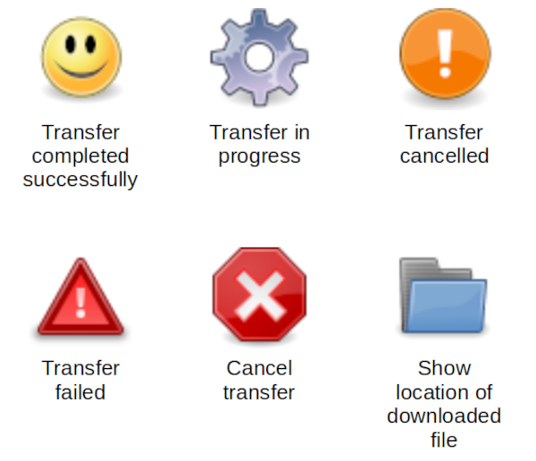

# Downloads dialog 

The Downloads dialog is the user interface to JGemini's download manager.
JGemini will handle multiple transfers -- documents and streams -- in
the background, on the understanding that some will take a significant
time to complete, if they ever do. You can use the Downloads dialog
to monitor these transfers and, if necessary, cancel them.

As each download or streaming operation starts, it will be listed in the
Downloads dialog. There are a number of icons that show the status of the
transfer, and appear on buttons that allow you to manage it.

You can cancel a transfer, whether it is a streaming operation or a file
download, using the "X" button. If you cancel a download before it completes,
JGemini removes the partially-downloaded file. If you cancel a streaming
operation, JGemini will terminate the application that was playing the stream.

When a file download is complete, you can use the "folder" button to
show the location of the file. 

The "Clear" button removes from the list any downloads that are no longer
in progress. This does not remove any downloaded files. 

When you exit JGemini with transfers pending, JGemini will warn you,
and ask if you want to cancel them.  

Unlike most web browsers, for reasons of privacy JGemini does not store
information about downloads between sessions. The download manager will always
be empty when you start JGemini.  If you choose specifically to download a file
then, of course, JGemini will not delete it. It will, however, delete files that
you downloaded to be handed off to the desktop.

[Documentation index](index.md)

